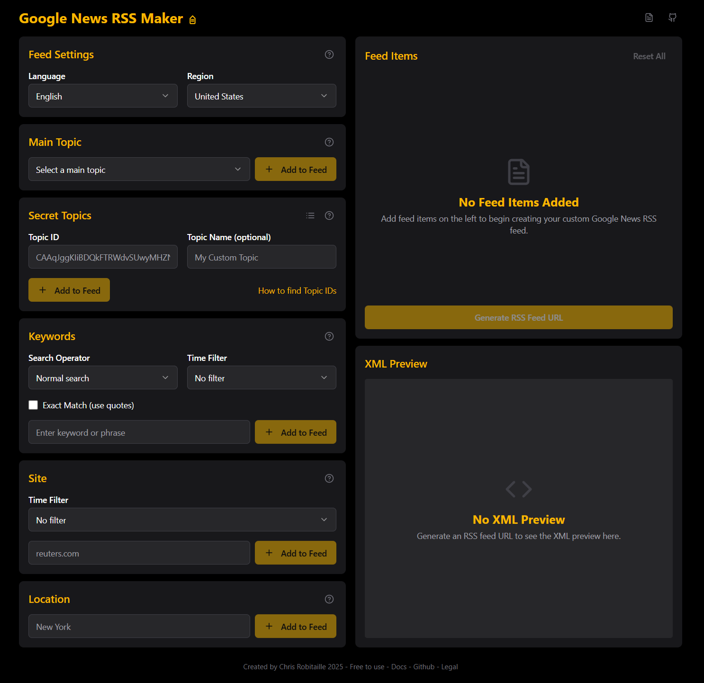

# Google News RSS Generator

Google News RSS Generator allows you to create custom RSS feeds from Google News by combining topics, keywords, sites, and locations. This tool helps you get the most out of Google News' RSS capabilities, which are more powerful than most people realize.

You can use these RSS feeds in any feed reader or for data collection purposes. The tool generates the correct URL syntax based on your selections.




## 📦 Feed Types

### 🔹 Topic ID
Google News organizes content by topics, each with a unique ID.

**Example:**  
`CAAqJggKIiBDQkFTRWdvSUwyMHZNRGx6TVdZU0FtVnVHZ0pWVXlnQVAB`

---

### 🔹 Keyword
Search for news articles containing specific keywords or phrases.  
Supports advanced search operators.

**Example:**  
`artificial intelligence` or `allintitle:climate change`

---

### 🔹 Site
Get news from specific websites indexed by Google News.  
Just enter the domain name (no `http://` or `www`).

**Example:**  
`reuters.com` or `nytimes.com`

---

### 🔹 Location
Find news about specific geographic locations.

**Example:**  
`New York`, `California`

---

## 🧠 Advanced Search Options

### 🔍 Search Operators

- `allintext:` — All terms in the article body
- `intitle:` — Term in article title
- `allintitle:` — All terms in the title
- `inurl:` — Term in the URL
- `allinurl:` — All terms in the URL
- `"climate change"` — Exact phrase search

---

### 🕓 Time Filters

Limit results to a specific time frame:

- Past hour
- Past 3 hours
- Past 12 hours
- Past day
- Past week
- Past month
- Past year

---

## 🛠️ How to Use

1. **Select Language and Region**  
   Choose your preferred language and region.

2. **Choose Feed Type**  
   Select from Topic ID, Keyword, Site, or Location.

3. **Configure Advanced Options**  
   Add operators and time filters as needed.

4. **Add Items to Your Feed**  
   Enter your values and click “Add to Feed”.

5. **Generate RSS URL**  
   Click “Generate RSS Feed URL” to create your feed.

6. **Copy and Use**  
   Use the URL in your RSS reader or app.

---

## ⚠️ Limitations

- Feeds are limited to 100 articles
- Only one topic or location per feed
- Keywords and sites support OR operators
- Not all languages/regions are supported
- Google does not officially document this RSS structure


## 🧪 Local Development

```bash
git clone https://github.com/degeniusone/Google-News-Rss-Feed-Maker.git
cd Google-News-Rss-Feed-Maker

bun install      # or npm install
bun dev          # or npm run dev
```

Visit `http://localhost:3000`

---

## 🌐 Deployment

Use the **one-click Vercel deploy** button above, or manually:

1. Connect the GitHub repo in your Vercel dashboard
2. Use default `bun run build` or `npm run build`
3. Deploy with default output settings

---

## 🛠 Tech Stack

- Bun (or Node.js)
- Vite / React (via v0.dev)
- No database, no API

---

## 🔐 Environment

No `.env` or keys required.

---

## 📄 License

MIT License © 2024 Chris Robitaille
